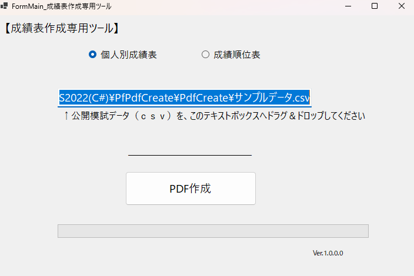
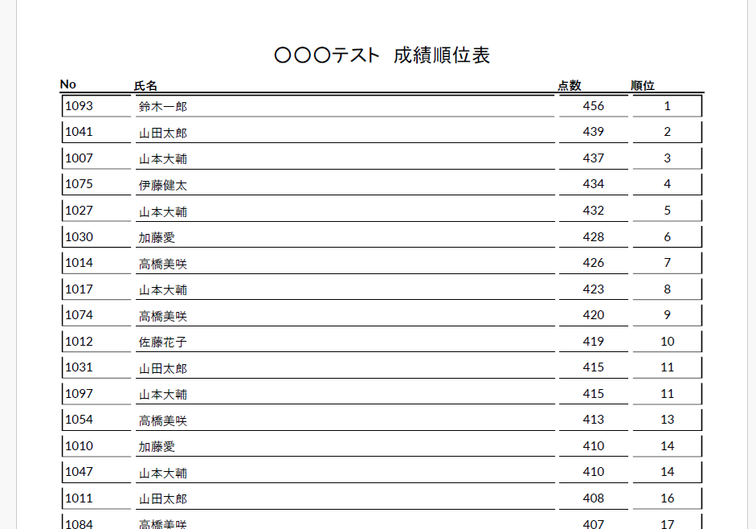
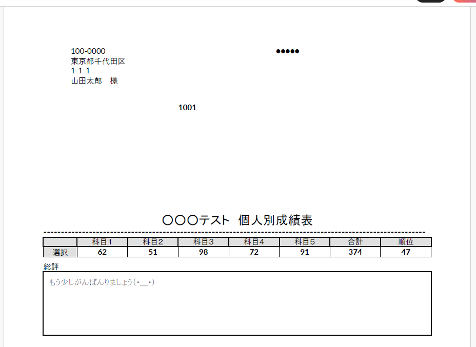

# PdfCreate
# 成績表PDF一括作成ツール

## 概要

CSVファイルを読み込み、
以下の2種類のPDFを一括生成できるWindowsアプリケーションです。

* 個人別成績表（1人1ページ）
* 成績順位表（一覧表）

大量データ（数百～数千件）でもまとめて出力可能です。

---

## 主な機能

* CSVファイルのドラッグ＆ドロップ読み込み
* 個人別成績表のPDF生成
* 成績順位表のPDF生成
* 進捗バーによる処理状況の可視化
* エラー時のメッセージ表示

---

## 使用技術

* C#
* .NET 6
* QuestPDF（PDF生成）
* Windows Forms

---

## 画面イメージ

### メイン画面

### 成績順位表

### 個人別成績表

---

## 使い方

1. CSVファイルを画面にドラッグ＆ドロップ
2. 出力形式を選択（個人別 / 順位表）
3. 「PDF作成」ボタンをクリック
4. 指定フォルダにPDFが出力されます

---

## 工夫したポイント

* QuestPDFのレイアウトを調整し、見やすい帳票デザインを実現
* Column構造を利用してタイトル・表・コメントを整理
* 大量データ処理時でもUIが固まらないよう非同期処理（async/await）を使用
* 進捗バーを実装し、ユーザーに処理状況を明示

---

## 今後の改善案

* PDF出力フォルダの指定機能
* CSVフォーマットの自動判定
* Webアプリ版への展開（ASP.NET Core）

---

## 補足

本アプリは業務効率化を目的として作成したツールです。
帳票出力やデータ処理のサンプルとしてご利用ください。
